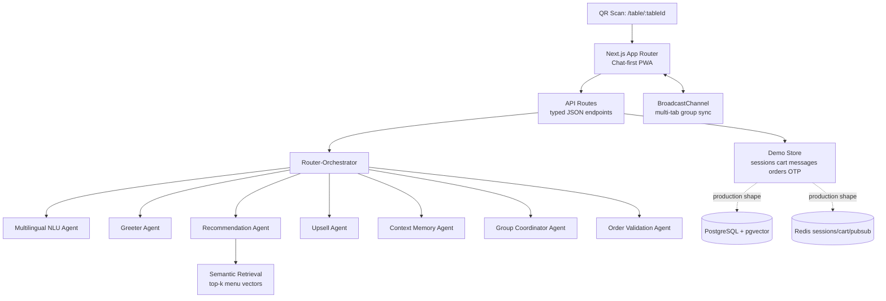
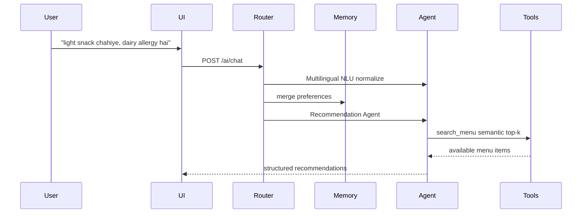

# AI-Driven Smart Dining Assistant

AI-first, multi-agent smart dining assistant for restaurant table ordering.

This is not a basic food ordering app. Customers scan a QR code, enter a table-scoped session, and order through Zara, a chat-first AI assistant that routes every message through specialist agents, retrieves grounded menu recommendations with RAG, syncs a shared group cart, and completes checkout with OTP validation.

## Demo

Open `http://localhost:3000/table/T1`.

Try these flows:

- `something spicy but not heavy`
- `light snack chahiye, dairy allergy hai`
- `we are 4 people, mix veg and non-veg`
- `add garlic naan to our order`
- Checkout with mock OTP `123456`

The demo runs without external AI, SMS, PostgreSQL, or Redis credentials. It uses deterministic local embeddings and an in-memory repository shaped like the production data layer so reviewers can run it quickly.

## User Journey

1. User scans a table QR code and lands on `/table/:tableId`.
2. Zara greets the table and captures lightweight preferences such as spicy, light, filling, dessert, drinks, or group order.
3. User chats in English, Hinglish, or Telugu-English.
4. Router-Orchestrator classifies intent and dispatches to the right specialist agent.
5. Recommendation Agent retrieves real menu items through RAG and returns 2-3 grounded choices.
6. User adds items from chat or menu cards; the shared table cart updates for everyone.
7. Upsell Agent suggests a complementary item, beverage, or combo only when cart context makes it relevant.
8. Group diners join the same table session and see synced cart state with item ownership.
9. Checkout collects name and phone, verifies mock OTP `123456`, validates the cart, and places the order.

This flow is designed so a first-time diner can order in under 3 minutes without browsing the full menu. AI reduces decision time by turning vague intent like "something spicy but not heavy" into a small grounded shortlist.

## Architecture



## Tech Stack

| Layer | Implementation |
|---|---|
| Frontend | Next.js App Router, React, TypeScript, responsive CSS |
| Backend | Next.js API routes with service-layer boundaries |
| AI orchestration | Router-Orchestrator plus specialist agents |
| RAG | Deterministic embeddings, cosine similarity, top-k retrieval |
| Demo state | In-memory repository persisted in process |
| Production data target | PostgreSQL, Redis, pgvector schema included |
| Realtime demo | Browser BroadcastChannel for same-table multi-tab sync |
| Tests | Vitest unit tests for RAG, routing, cart, OTP, order validation |

## Design Decisions

- Router-Orchestrator vs single agent: keeps prompts small, routes fast paths cheaply, makes every agent testable, and prevents one monolithic prompt from owning cart, memory, RAG, and checkout logic.
- RAG vs keyword filtering: supports semantic requests like "not heavy", "chatpata", or "good for groups" while preventing recommendations outside the actual menu.
- In-memory store for demo: removes PostgreSQL/Redis setup friction for reviewers; the service boundaries and Prisma schema show the production migration path.
- BroadcastChannel vs WebSockets in demo: proves real-time same-table sync locally with zero infrastructure; production swaps this for WebSockets plus Redis pub/sub.
- Deterministic local embeddings: keeps the assignment runnable without API keys; production can replace the embedding function with `text-embedding-3-small`.

## AI System Design



| Agent | Trigger | Responsibility | Tools |
|---|---|---|---|
| Greeter Agent | First greeting intent | Welcome diner, set chat-first tone | session context |
| Multilingual NLU Agent | Every message | Normalize English, Hinglish, Telugu-English | intent classifier |
| Context Memory Agent | Every message | Persist preferences, allergens, language, group size | session memory |
| Recommendation Agent | Food/search intent | RAG-backed recommendations from actual menu items | semantic search, cart |
| Upsell Agent | Cart mutation | Complementary item, missing beverage, combo threshold | cart, complements |
| Group Coordinator Agent | Group intent | Shared suggestions for mixed veg/non-veg tables | cart, preferences |
| Order Validation Agent | Checkout | Validate non-empty cart and item availability | cart, order service |

## RAG

Each menu item is converted into a document:

```text
name + category + description + tags + allergens + calorie/prep signals
```

The Recommendation Agent:

1. Normalizes user input and extracts preferences.
2. Embeds the query locally for demo mode.
3. Runs cosine similarity over menu vectors.
4. Applies hard filters: availability, allergens, vegetarian/non-vegetarian, already in cart.
5. Returns strict structured recommendations with item IDs, names, prices, reasons, tags, and allergens.

Production swap: replace `lib/ai/embeddings.ts` and `lib/ai/rag.ts` with `text-embedding-3-small` plus pgvector or a managed vector database.

## Preventing Hallucination

- Recommendation Agent only receives retrieved menu items, not the entire open-ended model memory.
- Hard filters run before response generation: availability, allergens, veg/non-veg preference, and already-in-cart exclusion.
- Structured output requires `itemId`, `name`, `price`, `reason`, `tags`, and `allergens`.
- Add-to-cart uses the canonical `itemId`; the AI cannot create arbitrary cart items.
- Tests assert that RAG excludes allergens and does not recommend items already in the cart.

## Setup

1. Install dependencies:
   ```bash
   npm install
   ```

2. Create environment file:
   ```bash
   cp .env.example .env
   ```

3. Run tests:
   ```bash
   npm test
   ```

4. Start the app:
   ```bash
   npm run dev
   ```

5. Open:
   ```text
   http://localhost:3000/table/T1
   ```

## API Overview

| Method | Endpoint | Purpose |
|---|---|---|
| `GET` | `/api/table/:tableId/session` | Create/resume table session |
| `GET` | `/api/menu` | Fetch seeded menu |
| `GET` | `/api/menu/search?q=` | Semantic menu search |
| `POST` | `/api/session/:id/ai/chat` | Route message through AI orchestrator |
| `GET` | `/api/session/:id/ai/stream` | SSE token stream for latest assistant message |
| `GET` | `/api/session/:id/cart` | Fetch shared cart |
| `POST` | `/api/session/:id/cart` | Add item and trigger upsell |
| `PATCH` | `/api/session/:id/cart/:cartItemId` | Update cart quantity/instructions |
| `DELETE` | `/api/session/:id/cart/:cartItemId` | Remove cart item |
| `POST` | `/api/otp/send` | Send mock OTP |
| `POST` | `/api/otp/verify` | Verify OTP |
| `POST` | `/api/session/:id/order` | Validate and place order |

## Example AI Interactions

**User**

```text
something spicy but not heavy
```

**Zara**

Returns up to 3 available spicy/light menu items, excludes cart duplicates, and includes reasons grounded in retrieved item metadata.

**User**

```text
light snack chahiye, dairy allergy hai
```

**NLU**

```json
{
  "intent": "RECOMMEND",
  "language": "hinglish",
  "preferences": {
    "light": true,
    "mealType": "starter",
    "excludeAllergens": ["dairy"]
  }
}
```

**User**

```text
add garlic naan to our order
```

**System**

Routes to `ADD_ITEM`, calls `add_to_cart`, broadcasts the shared cart, then triggers the Upsell Agent.

## Prompt Examples

### Recommendation Agent

```text
SYSTEM:
You are Zara, a warm dining assistant. Recommend only from retrieved menu items.

CONTEXT:
- Table: {tableId}
- Preferences: {spicy, light, excludeAllergens, vegetarian, nonVegetarian}
- Current cart: {cartItems}
- Retrieved menu items: {topKMenuItems}

TASK:
Suggest at most 3 items that match the user request and table context.

CONSTRAINTS:
- Never mention items outside retrieved menu items.
- Never suggest unavailable items or allergens excluded by session memory.
- Keep copy concise and useful.

OUTPUT JSON:
{ "message": string, "suggestions": [{ "itemId": string, "name": string, "price": number, "reason": string }] }
```

### Upsell Agent

```text
SYSTEM:
You are Zara's Upsell Agent. Suggest helpful add-ons without being pushy.

CONTEXT:
- Added item: {addedItem}
- Cart: {cart}
- Complementary items: {complements}
- Time of day: {timeOfDay}

TASK:
Return one relevant upsell only if it improves the meal.

OUTPUT JSON:
{ "trigger": "COMPLEMENT" | "MISSING_BEVERAGE" | "COMBO_THRESHOLD", "itemId": string, "message": string }
```

### Multilingual NLU Agent

```text
SYSTEM:
Normalize English, Hinglish, and Telugu-English dining messages into routing JSON.

USER:
"light snack chahiye, dairy allergy hai"

OUTPUT JSON:
{
  "intent": "RECOMMEND",
  "language": "hinglish",
  "preferences": {
    "light": true,
    "mealType": "starter",
    "excludeAllergens": ["dairy"]
  }
}
```

## Example Agent Trace

User: `kuch spicy aur light chahiye, non-veg ok hai`

```text
1. Multilingual NLU Agent
   -> { intent: "RECOMMEND", language: "hinglish", spicy: true, light: true, nonVegetarian: true }

2. Context Memory Agent
   -> merges preferences into session memory for the table

3. Recommendation Agent
   -> embeds "spicy light non-veg starter"
   -> retrieves top 10 semantic menu matches
   -> filters unavailable, allergens, and cart duplicates
   -> selects best 3 grounded items

4. Response Formatter
   -> returns structured recommendation cards to the UI
```

Second trace:

```text
User: "add garlic naan to our order"

1. NLU -> { intent: "ADD_ITEM", itemQuery: "garlic naan" }
2. Cart Tool -> add_to_cart(sessionId, itemId: "m-012", qty: 1)
3. Upsell Agent -> finds complementary curry or dip
4. Broadcast -> shared table cart updates across open tabs
```

## Evaluation Alignment

| Evaluation Area | How this implementation addresses it |
|---|---|
| Flow simplicity | QR route opens directly to chat, AI picks, menu, cart, and checkout in one screen |
| AI relevance | RAG retrieval plus preference filters grounds suggestions in real menu data |
| Context continuity | Context Memory Agent persists language, allergens, group size, and cart state |
| Upselling | Trigger-based Upsell Agent uses complements, beverages, and combo thresholds |
| Multi-agent coordination | Router-Orchestrator produces visible route labels and agent traces |
| Multilingual handling | NLU supports English, Hinglish, and Telugu-English patterns |
| Performance | Local routing, bounded top-k search, compact responses, and SSE-ready endpoint |
| System design | Services separate AI, cart, session, OTP, order, and data concerns |

## Tradeoffs

- Demo uses in-memory services to keep evaluation friction low; `prisma/schema.prisma` and `docker-compose.yml` show the intended PostgreSQL/Redis/pgvector deployment shape.
- BroadcastChannel gives instant multi-tab sync locally; production should replace it with WebSockets plus Redis pub/sub.
- Local deterministic embeddings avoid needing an OpenAI key; production should use hosted embeddings for stronger semantic retrieval.
- OTP is mocked with `123456`; production should use Twilio Verify or MSG91.

## Future Improvements

- Kitchen dashboard with order status transitions.
- Admin menu manager with embedding refresh.
- Long-term preference memory keyed by phone hash.
- Voice ordering.
- Human staff escalation from sentiment detection.
- A/B testing for upsell copy and timing.
