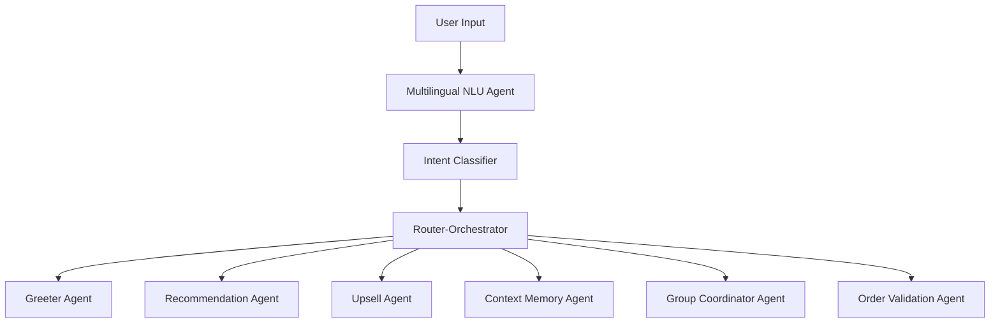
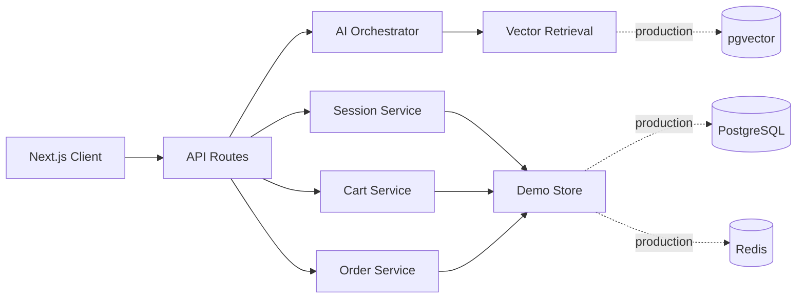

# Product Requirements Document: AI-Driven Smart Dining Assistant

## Product Vision

Build an AI-first dining assistant where natural language is the primary ordering interface. The system should reduce decision time, improve average order value through helpful contextual upsells, support multilingual Indian dining patterns, and keep group orders synchronized by table.

Core flow:

```text
QR scan -> table session -> Zara greets user -> conversational ordering -> group cart sync -> OTP checkout -> order validation
```

## Core User Journey

1. User scans QR and opens `/table/{tableId}`.
2. A table-scoped session is created or resumed with a 4-hour TTL.
3. Zara greets the diner and captures preference signals such as spicy, light, filling, dessert, drinks, or group order.
4. User sends a natural-language message in English, Hinglish, or Telugu-English.
5. Router-Orchestrator classifies the message and dispatches to the right agent.
6. Recommendation Agent uses RAG to return a small grounded shortlist instead of forcing full menu browsing.
7. User adds items from chat cards or menu cards.
8. Shared cart updates in real time for the table, including owner labels and totals.
9. Upsell Agent suggests one contextual complement only when cart state supports it.
10. Checkout collects name and phone, verifies mock OTP, validates the cart, and creates the order.

Success metric: a first-time diner should be able to move from QR scan to placed order in under 3 minutes.

## Personas

| Persona | Goal | Product Response |
|---|---|---|
| Solo diner | Decide quickly | Zara recommends 2-3 grounded options by mood and appetite |
| Group diners | Avoid cart confusion | Table-scoped shared cart, ownership labels, real-time sync |
| Dietary-sensitive diner | Avoid allergens | Session memory stores exclusions and RAG filters results |
| Restaurant operator | Increase AOV | Upsell Agent suggests complements and drinks without hard selling |

## Functional Requirements

| Area | Requirement |
|---|---|
| QR entry | `/table/{tableId}` creates or resumes a 4-hour anonymous session |
| Chat ordering | English, Hinglish, Telugu-English input; quick prompts; streaming-ready responses |
| Recommendations | Recommendation Agent must use embeddings, semantic top-k retrieval, prompt context injection, and structured output |
| Shared cart | Table-scoped state with item ownership, quantity changes, totals, GST |
| Upselling | Trigger after add-to-cart, missing beverages, combo threshold, and checkout intent |
| Memory | Store language, allergens, spice/light/filling preferences, group size |
| Checkout | Name and phone collection; mock OTP accepted; validate cart before order |
| Menu | Category filters, text search, availability, allergens, tags, images |

## Non-Functional Requirements

| Metric | Target | Implementation Strategy |
|---|---|---|
| Page load | `<2s` | App Router, local assets, compact CSS |
| First AI token | `<800ms` | Fast local router in demo, SSE endpoint |
| Full AI response | `<3s` | Short bounded responses, top-k retrieval |
| Real-time update | `<200ms` | BroadcastChannel demo; Redis pub/sub production |
| Menu search | `<100ms` | Client filter plus server semantic search |
| Reliability | Demo runs without external services | In-memory repository with production-shaped interfaces |

## AI System Design

Pattern: Router-Orchestrator.



| Agent | Responsibility | Input | Output |
|---|---|---|---|
| Greeter Agent | Welcome diner and start preference capture | session | greeting text |
| Multilingual NLU Agent | Normalize mixed-language text | raw message | intent, language, preferences |
| Context Memory Agent | Persist session preferences | NLU result | merged preferences |
| Recommendation Agent | RAG menu intelligence | query, preferences, cart | structured suggestions |
| Upsell Agent | Contextual add-ons | cart, added item | upsell card |
| Group Coordinator Agent | Multi-user meal balancing | group intent, preferences | group suggestions |
| Order Validation Agent | Pre-checkout validation | cart | valid/error |

## Architecture Rationale

- Router-Orchestrator vs single agent: improves modularity, reduces prompt size, keeps low-latency routing separate from specialist reasoning, and makes agent behavior easier to test.
- RAG vs keyword search: handles semantic dining language like "not heavy", "chatpata", "something refreshing", and "good for groups" while grounding every result in actual menu data.
- In-memory demo store vs required infrastructure: lets reviewers run the app immediately; production adapters are represented by service boundaries, Docker, and Prisma schema.
- BroadcastChannel demo sync vs WebSockets: proves real-time shared-cart behavior locally; production replaces it with WebSockets and Redis pub/sub.
- Local deterministic embeddings vs hosted embeddings: removes API-key dependency for evaluation; production can swap in `text-embedding-3-small`.

## RAG Design

The Recommendation Agent embeds menu documents and user queries. Retrieval uses cosine similarity with hard safety filters:

- Do not recommend unavailable items.
- Do not recommend items already in cart.
- Respect allergen exclusions for the full session.
- Respect vegetarian/non-vegetarian preferences.
- Return max 3 recommendations in normal chat.

Structured recommendation schema:

```json
{
  "message": "Short response",
  "suggestions": [
    {
      "itemId": "m-002",
      "name": "Chilli Chicken Bites",
      "price": 260,
      "reason": "Spicy, light, quick serve",
      "tags": ["non-veg", "spicy", "light"]
    }
  ]
}
```

## Prompt Engineering

Prompts follow `ROLE -> CONTEXT -> TASK -> CONSTRAINTS -> OUTPUT` so each agent has a narrow job and predictable schema.

### Recommendation Agent Prompt

```text
ROLE:
You are Zara, a warm dining assistant. Recommend only from retrieved menu items.

CONTEXT:
- Table: {tableId}
- Preferences: {preferences}
- Current cart: {cart}
- Retrieved menu items: {topKMenuItems}

TASK:
Suggest at most 3 items that match the user's request.

CONSTRAINTS:
- Never mention items outside retrieved menu items.
- Never suggest unavailable items.
- Never suggest allergens excluded by session memory.
- Keep response concise.

OUTPUT:
Strict JSON with message and suggestions[].
```

### Upsell Agent Prompt

```text
ROLE:
You are the Upsell Agent. Suggest useful add-ons without sounding pushy.

CONTEXT:
- Added item: {addedItem}
- Cart: {cart}
- Complementary items: {complements}

TASK:
Return one add-on only if it clearly improves the meal.

OUTPUT:
Strict JSON with trigger, itemId, name, price, and message.
```

### Multilingual NLU Prompt

```text
ROLE:
Normalize English, Hinglish, and Telugu-English dining messages into routing JSON.

USER:
"konchem spicy ga undali, veg kaadu"

OUTPUT:
{
  "intent": "RECOMMEND",
  "language": "telugu-english",
  "preferences": { "spicy": true, "nonVegetarian": true }
}
```

## Example Agent Trace

User: `kuch spicy aur light chahiye, non-veg ok hai`

```text
1. Multilingual NLU Agent
   -> { intent: "RECOMMEND", language: "hinglish", spicy: true, light: true, nonVegetarian: true }

2. Context Memory Agent
   -> persists spicy/light/non-veg preferences in table session memory

3. Recommendation Agent
   -> embeds query
   -> retrieves top 10 menu candidates
   -> filters unavailable items, allergens, and cart duplicates
   -> returns best 3 structured recommendations

4. UI
   -> renders recommendation cards with Add buttons
```

User: `add garlic naan to our order`

```text
1. NLU Agent
   -> { intent: "ADD_ITEM", itemQuery: "garlic naan" }

2. Cart Tool
   -> add_to_cart(sessionId, itemId: "m-012", qty: 1)

3. Upsell Agent
   -> checks complementary items and cart state

4. Realtime Layer
   -> broadcasts updated shared cart to the table
```

## Hallucination Controls

- The Recommendation Agent can only recommend from retrieved menu candidates.
- Tool calls use canonical menu IDs; generated item names cannot create cart rows.
- Availability, allergen, veg/non-veg, and already-in-cart filters run before response formatting.
- Agent outputs are structured and rendered as cards tied to real menu records.
- Tests cover allergen exclusion, cart exclusion, routing, add-to-cart, OTP, and order validation.

## System Architecture



## Data Model Overview

Key entities:

- `menu_items`: item metadata, price, tags, allergens, availability, popularity, complements.
- `menu_embeddings`: vector per menu item document.
- `sessions`: table session, preferences, summary, expiry.
- `cart_items`: session cart rows with ownership and instructions.
- `messages`: conversation history and agent attribution.
- `orders`: validated checkout result.
- `order_items`: immutable order line items.

## API Design

| Method | Endpoint | Description |
|---|---|---|
| `GET` | `/api/table/:tableId/session` | Create or resume table session |
| `GET` | `/api/menu` | Fetch menu |
| `GET` | `/api/menu/search?q=` | Semantic menu retrieval |
| `POST` | `/api/session/:id/ai/chat` | Run orchestrator |
| `GET` | `/api/session/:id/ai/stream` | SSE stream |
| `GET/POST` | `/api/session/:id/cart` | Read/add cart |
| `PATCH/DELETE` | `/api/session/:id/cart/:cartItemId` | Update/remove cart line |
| `POST` | `/api/otp/send` | Send mock OTP |
| `POST` | `/api/otp/verify` | Verify OTP |
| `POST` | `/api/session/:id/order` | Validate and place order |

## Real-Time System Design

Demo:

- Browser `BroadcastChannel` named by table.
- All tabs on `/table/T1` receive cart updates.
- Shared cart updates include item ownership and totals.

Production:

- WebSocket gateway subscribes clients to `table:{tableId}`.
- Redis pub/sub broadcasts `cart:item_added`, `cart:item_updated`, `cart:item_removed`, `order:placed`.
- PostgreSQL receives final order state.

## Tradeoffs and Assumptions

- In-memory services are intentional for frictionless assignment review.
- The codebase keeps service and agent boundaries so Redis/PostgreSQL/OpenAI adapters can replace demo implementations.
- Mock OTP is accepted for demo; production requires an SMS provider.
- BroadcastChannel proves group sync locally; production WebSocket gateway is documented and API-shaped.

## Evaluation Alignment

| Evaluation Criteria | Product/System Evidence |
|---|---|
| Flow simplicity | One-screen table route with chat, AI picks, menu, cart, and checkout |
| AI relevance | RAG retrieval, preference extraction, and hard filters |
| Context continuity | Context Memory Agent stores allergens, language, appetite, and group size |
| Upselling effectiveness | Trigger-based complements, beverage gaps, and combo thresholds |
| Multi-agent coordination | Router-Orchestrator with explicit agent responsibilities and traces |
| Multilingual handling | NLU normalizes English, Hinglish, and Telugu-English |
| System design | API, AI, cart, session, OTP, order, and data layers are separated |
| Performance | Local routing, bounded top-k retrieval, short responses, SSE-ready stream |

## Future Improvements

- WebSocket server with Redis pub/sub.
- Kitchen dashboard and order state changes.
- Admin menu editor with embedding refresh.
- Long-term preferences via phone hash.
- Sentiment Agent and staff escalation.
- Voice ordering and multilingual speech input.
